<div align="center">

# Focus Mate — AI-Powered Virtual Classroom

Real-time attention monitoring with webcam-based gaze/head-pose AI, lock-mode enforcement, tab-switch alerts (Chrome extension), granular attention labels, and downloadable engagement reports.

</div>

## Features
- **FastAPI backend** with JWT auth, REST + WebSocket channels, and extended event schemas for granular attention labels, gaze vectors, and head-pose metadata.
- **React teacher, student, and labeling portals** (Vite + TypeScript) branded as Focus Mate with calibration flow, TF.js inference wrapper, label breakdown widgets, and manual labeling UI.
- **Attention telemetry** via low-res frame capture, client-side inference (TF.js model or heuristic fallback), tab visibility sensors, lock-mode enforcement, and Chrome extension events.
- **AI pipeline**: dataset ingestion scripts, augmentation, MobileNetV2-based training, evaluation, export to TF Lite / TF.js, calibration tooling, and active-learning queue.
- **Chrome extension** (Manifest v3) for robust tab-switch counting, badge display, retry queue, and configuration popup (API base, JWT vc_token, session & attendance IDs).
- **Reporting & data layer**: PostgreSQL-ready models, SQLite dev defaults, SQL migration scripts, CSV/PDF export, and Postman collection.
- **DevOps ready**: Dockerfiles, docker-compose stack, pytest + vitest suites, ml scripts, and GitHub Actions workflow for lint/test/build.

# Screenshots

## Login

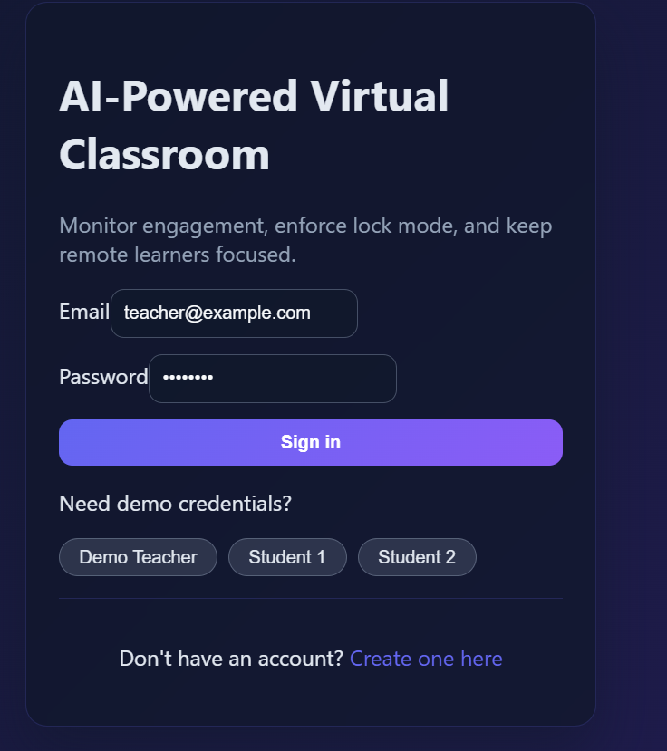

---

## Register

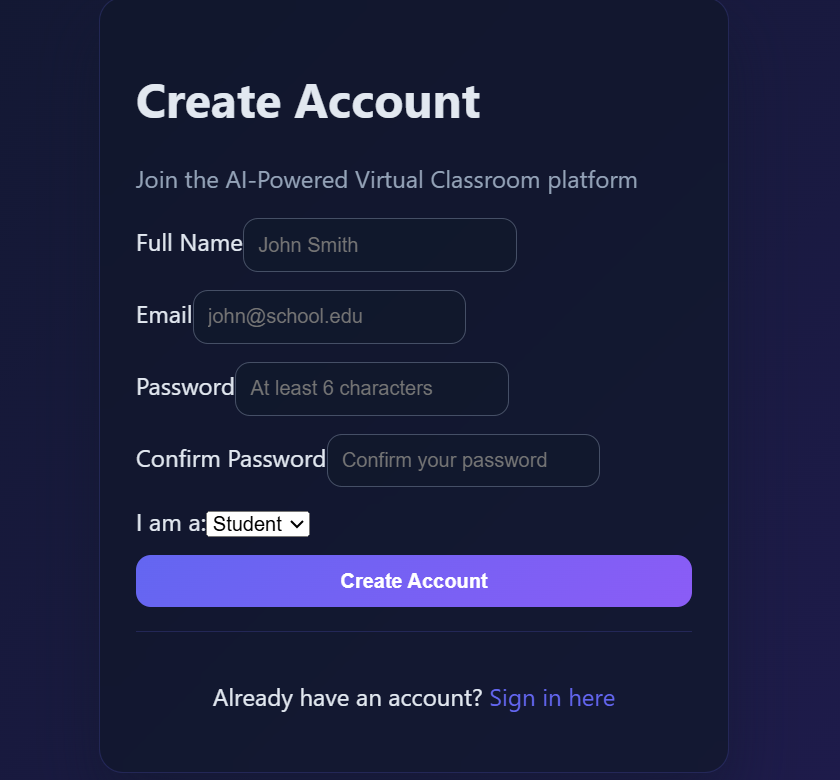

---

## Teacher Dashboard

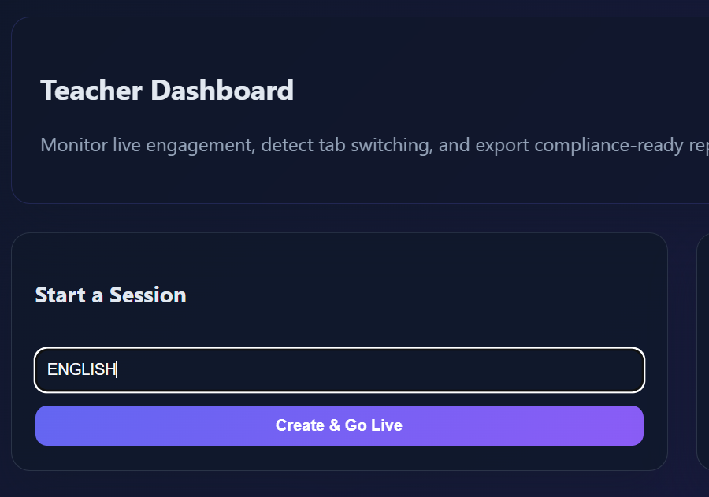

---

## Student Dashboard

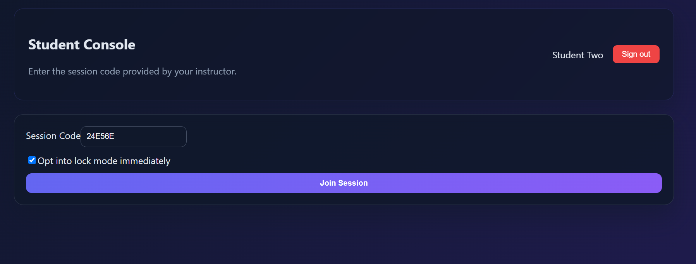

---

## Active Sessions

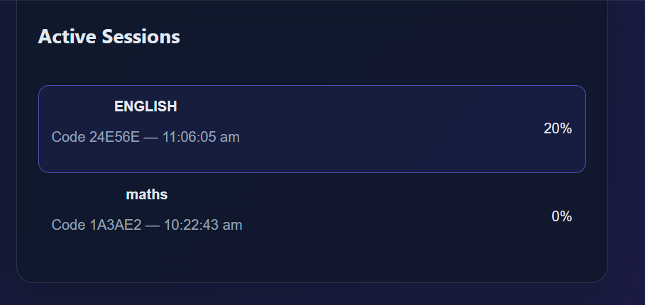

---

## AI Attention Detection

### Focused

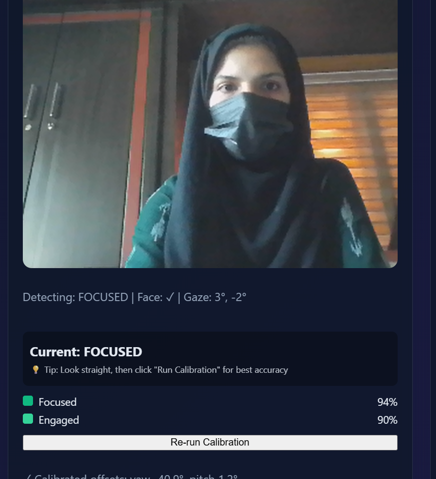

### Looking Left

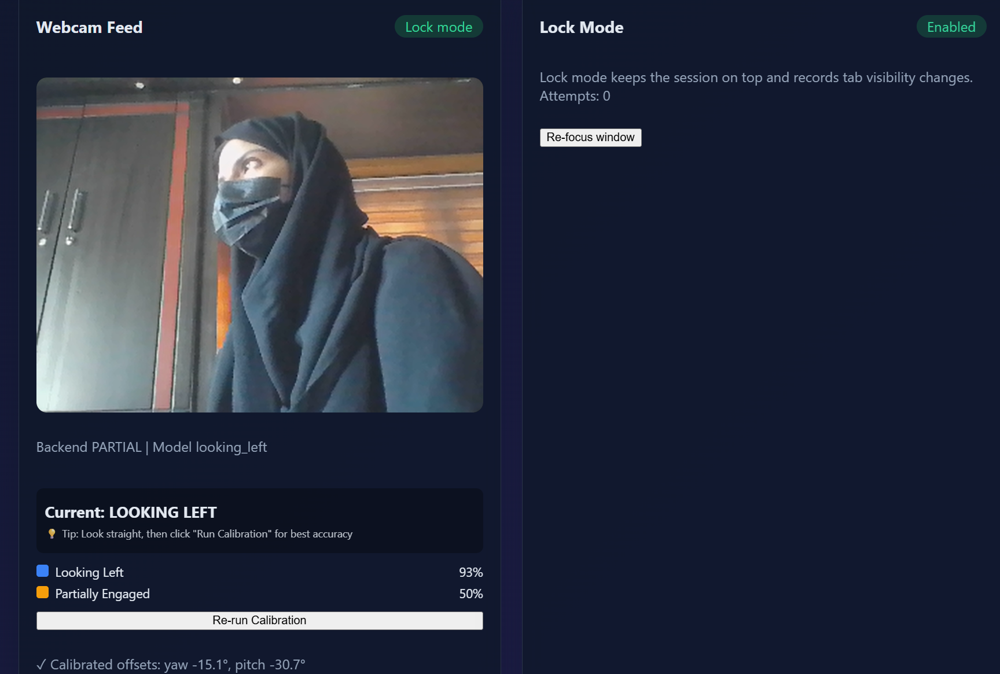

### Looking Right

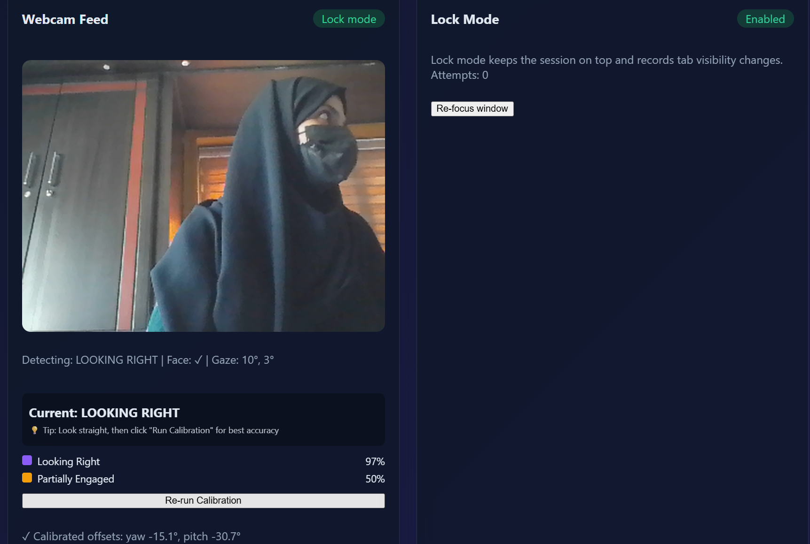

### Looking Up

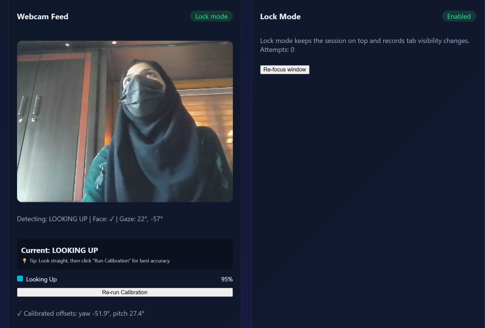

### No Face

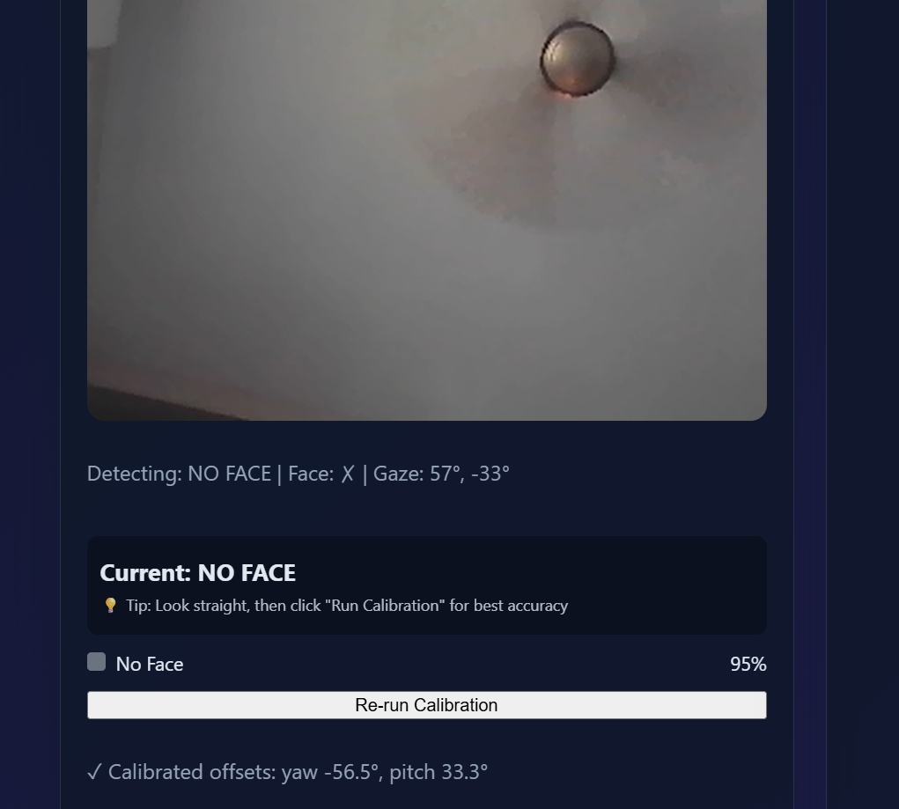

---

## Live Alerts

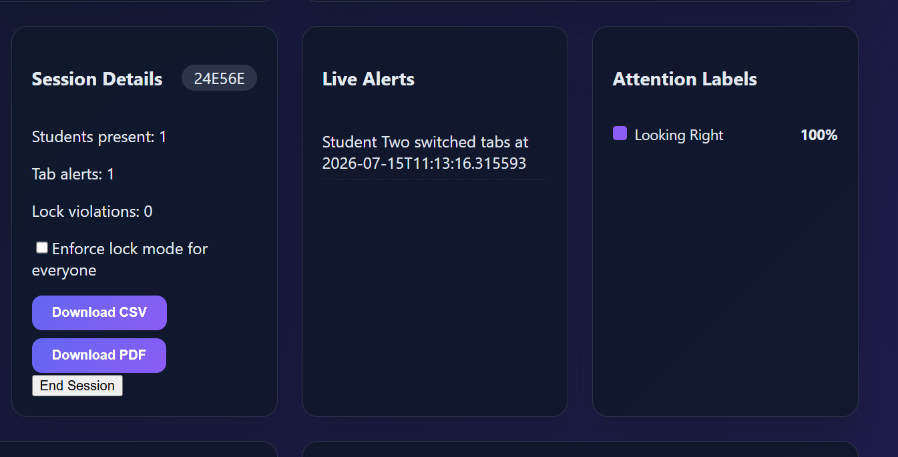

## Repo Structure
```
backend/        FastAPI app, models, services, tests
frontend/       React (Vite) app with teacher/student/labeler UIs
extension/      Chrome extension source (manifest v3)
ml/             Data ingestion, augmentation, training, export, calibration
scripts/        SQL migrations + demo seed helper
docs/           Demo script, architecture notes
Postman/        API collection for quick testing
.github/        CI workflow
docker-compose.yml
```

## Tech Stack
- **Backend**: Python 3.11, FastAPI, SQLAlchemy 2, PostgreSQL/SQLite, JWT auth, OpenCV + MediaPipe heuristics, ReportLab for PDFs.
- **Frontend**: React 18, TypeScript, Vite, Plotly, @tensorflow/tfjs runtime, custom calibration.
- **Browser extension**: Chrome (Manifest v3) with popup/content/background architecture, badge + retry queue.
- **ML tooling**: TensorFlow/Keras for model training, TF Lite/TF.js export, NumPy/OpenCV for augmentation.
- **Testing/CI**: pytest, vitest, GitHub Actions.

## Quickstart (Local Dev)
1. **Backend**
   ```bash
   cd backend
   python -m venv .venv && source .venv/bin/activate   # use .venv\Scripts\Activate.ps1 on Windows
   pip install -r requirements.txt
   uvicorn app.main:app --reload
   ```
2. **Frontend**
   ```bash
   cd frontend
   npm install
   npm run dev
   ```
3. Browse to `http://localhost:5173` (frontend) and `http://localhost:8000/docs` (OpenAPI).

### Docker Compose
```bash
docker-compose up --build
```
Services:
- `backend`: FastAPI on `http://localhost:8000`
- `frontend`: Vite dev server on `http://localhost:5173`
- `db`: PostgreSQL (user/pass/db: `classroom`)

### Sample Credentials
| Role    | Email                  | Password |
| ------- | ---------------------- | -------- |
| Teacher | `teacher@example.com`  | `teach123` |
| Student | `student1@example.com` | `study123` |
| Student | `student2@example.com` | `study123` |

## Engagement, Gaze & Lock Mode
- Browser captures low-res frames roughly every 4 s and streams to `/api/events/frame` alongside heuristic engagement predictions. (Upcoming work will swap this heuristic for the TF.js/ONNX model described below.)
- Backend persists frame summaries plus tab-switch logs (`tab_switch_events`) and exposes label breakdown + tab counts through the dashboard/WebSockets.
- Tab visibility events come from both the web app and the Chrome extension’s background service worker for reliable tab-switch counts.
- Lock mode keeps the tab fullscreen and records escape attempts; attendance rows now include `attendance_id` so the extension can be configured quickly.

## Dataset Catalog & Prep Scripts

| Dataset | License / Access | Notes |
| --- | --- | --- |
| [GazeCapture](https://gazecapture.csail.mit.edu/) | Research-only (request) | Mobile-focused dataset for on-screen vs. off-screen attention. |
| [MPIIGaze](https://www.mpi-inf.mpg.de/departments/computer-vision-and-machine-learning/research/gaze-estimation/mpiigaze) | Non-commercial (request) | Laptop gaze/head-pose diversity. |
| [Columbia Gaze](http://www.cs.columbia.edu/CAVE/databases/columbia_gaze/) | Non-commercial (direct download) | Discrete left/right/up/down gaze samples. |
| [ETH-XGaze](https://ait.ethz.ch/projects/2020/xgaze/) | Research-only (request) | Large multi-view head-pose dataset. |
| [OpenEDS](https://research.fb.com/openeds-2020-challenge/) | CC BY-NC 4.0 (registration) | Eye segmentation / eye-openness cues. |
| Local calibration captures | User-provided | Record labeled snippets via `scripts/local_capture/capture_cli.py`. |

Scripts delivered in this step:

- `python scripts/data_ingest.py list` — inspect dataset catalog (links, licenses, adapters).
- `python scripts/data_ingest.py ingest synthetic_demo --limit 256` — generate synthetic samples for CI or dev testing.
- `python scripts/data_ingest.py ingest local_calibration --raw data/raw/local_calibration` — convert locally captured frames into the unified JSONL schema.
- `python scripts/augment.py data/processed/local_calibration/metadata.jsonl --out data/augmented/local_calibration --copies 3` — apply brightness/occlusion/noise augmentations to simulate left/right/up/down + low-light scenarios.
- `python scripts/local_capture/capture_cli.py --out data/raw/local_calibration --frames 20` — guided capture script with prompts (“look left”, “sleepy”, etc.).
- `python -m ml.train --data data/processed/synthetic_demo/metadata.jsonl --epochs 1 --output artifacts/demo_model` — train the MobileNetV3 multi-head network on any unified dataset.
- `python -m ml.eval --model artifacts/demo_model/saved_model --data data/processed/synthetic_demo/metadata.jsonl` — compute yaw/pitch MAE + per-label precision/recall.
- `python -m ml.export_model --model artifacts/demo_model/saved_model --out frontend/public/models/focusmate-attention` — emit TF Lite + TF.js bundles for client inference.
- `python -m ml.calibrate_client --recordings data/calibration.jsonl --out frontend/public/models/calibration.json` — aggregate calibration offsets.
- `python -m ml.active_learning --events exported_events.jsonl --threshold 0.45 --out labeling_queue.jsonl` — queue low-confidence frames for manual labeling.

All adapters write entries shaped like:

```json
{
  "frame_path": "data/processed/<dataset>/frames/img_0001.jpg",
  "gaze_yaw": -5.3,
  "gaze_pitch": 1.2,
  "head_yaw": -3.9,
  "head_pitch": 0.8,
  "eyes_open_prob": 0.92,
  "label": "looking_left",
  "confidence": 0.84,
  "meta": { "source": "local_calibration", "session": "20250109_120000" }
}
```

Adapters for the big public datasets are stubbed out (they require manual download after requesting access). Once the archives are in `data/raw/<slug>`, extend `scripts/datasets/adapters.py` with the parsing logic for that dataset.

## Calibration & Client Inference
- `VideoFeed` exposes a **Run Calibration** button that stores yaw/pitch offsets per device (localStorage). Calibration data is also exportable via `ml/calibrate_client.py`.
- `frontend/src/components/VideoProcessor.ts` tries to load `/models/focusmate-attention/model.json` (TF.js). If unavailable, it falls back to a landmark-intensity heuristic.
- Labels include: `focused`, `looking_left`, `looking_right`, `looking_up`, `looking_down`, `engaged`, `partial_engaged`, `sleepy`, `distracted_by_multi_face`, `no_face`, `unknown`.
- Mapping + confidence thresholds mirror `backend/app/core/labels.py` so server + client stay aligned.

## Labeling UI & Active Learning
- Teachers can open `/labeler` (link in dashboard header) for a lightweight labeling surface with keyboard shortcuts (1–9) and JSON export.
- The `ml/active_learning.py` script ingests stored events, filters low-confidence predictions, and writes a queue for manual labeling / fine-tuning.

## Chrome Extension (Manifest v3)
- Source lives in `extension/` (manifest, popup, background service worker, content script, icons).
- Popup fields: API Base (default `http://localhost:8000/api`), JWT token (`vc_token`), Session ID, Attendance ID, Debug toggle.
- Buttons: Save, Clear, Export/Import config, Clear counts. Status shows “Config saved. Tab switches will be counted.” + last POST timestamp/error.
- Content script (only on Focus Mate origins) debounces `visibilitychange/blur/focus/pagehide` and relays events to the background worker.
- Service worker maintains badge counts, persists config to `chrome.storage.local`, POSTs payloads to `/api/events/tab-switch`, and retries with exponential backoff when offline.
- Teacher dashboard exposes `attendance_id` per student so you can configure the extension quickly.

### Student Instructions (extension configuration)
1. Open `chrome://extensions`, enable **Developer mode**, click **“Load unpacked”**, and select the `extension` folder.
2. In the browser, log in as a student, join the session, then open DevTools → **Application** → Local Storage for `http://localhost:5173` → copy `vc_token`.
3. In a teacher tab (or via curl), open `/api/class/{sessionId}/dashboard` and note the `attendance_id` for that student.
4. Click the Focus Mate extension icon and fill:
   - **API Base**: `http://localhost:8000/api`
   - **JWT Token**: `<vc_token>`
   - **Session ID**: `<numeric session>`
   - **Attendance ID**: `<attendance_id>`
5. Press **Save**. Status should read “Config saved. Tab switches will be counted.”
6. Switching tabs/blur events now increment the badge and send POSTs with `{event_type:"tab_switch", tab_count:n, meta:{visibilityState}}` to the backend. Failed POSTs are queued and retried; last error is shown in the popup.

## API Overview (updated)
| Endpoint | Description |
| --- | --- |
| `POST /api/auth/login/json` | Obtain JWT |
| `GET /api/auth/me` | Current profile |
| `POST /api/class/create` | Teacher creates session |
| `GET /api/class/mine` | Teacher session list |
| `GET /api/class/code/{code}` | Lookup live session by code |
| `POST /api/class/{id}/join` | Student joins + attendance token |
| `POST /api/class/{id}/lock` | Toggle lock mode |
| `GET /api/class/{id}/dashboard` | Attendance + label breakdown + sleepy alerts (includes `attendance_id`) |
| `POST /api/events/frame` | Upload summarized frame data + labels/gaze/head pose |
| `POST /api/events/tab-switch` | Report tab switch (extension-friendly schema) |
| `GET /api/reports/{id}?format=csv/pdf` | Download report |
| `WS /ws/session/{id}?token=` | Live snapshots/alerts |

See `Postman/virtual-classroom.postman_collection.json` for ready-made requests (new entries document `attendance_id` discovery and tab-switch POSTs).

## Testing
```bash
# Backend
cd backend
pytest --maxfail=1 --disable-warnings --cov=app

# Frontend
cd frontend
npm run lint
npm run test
npm run build

# ML smoke test (synthetic)
python ml/data_ingest.py --dry-run
python ml/train.py --data data/unified.jsonl --epochs 1 --output artifacts/model
```

CI (`.github/workflows/ci.yml`) runs backend + frontend suites; ML scripts can run in dev or dedicated jobs.

## Privacy, Ethics & Security
- Frames are reduced to 160×120 JPEGs with ~50% quality to minimize PII; by default we transmit only labels/metrics. Disable frame upload if regulations require.
- Store JWTs in chrome.storage.local only for session duration; encourage short-lived tokens and use “Clear token” after each class.
- Always run Focus Mate over HTTPS/WSS in production; limit CORS origins to trusted classroom domains and the packaged extension ID.
- Data retention: persist aggregated stats (labels, gaze angles, tab counts) and avoid storing raw videos unless explicit consent is obtained. Add consent messaging when collecting calibration / in-house data.
- Dataset licenses: see official dataset pages (linked above) for terms; follow attribution requirements and do not redistribute raw data inside this repo.

## Documentation

Additional documentation is available in the `docs/` folder:

- docs/guides/
- docs/reports/

## Demo Script
Follow `docs/demo-script.md` for a teacher + two-student scenario. After running docker-compose, open teacher + student tabs, configure the extension, run calibration, and watch the label timeline update in real time. A second mini-demo (in README above) explains how to run a toy training/export cycle.

## Deployment Notes
- For production, point `DATABASE_URL` to managed Postgres (RDS, Cloud SQL, etc.) and configure `APP_SECRET_KEY`.
- Frontend can be built and served statically (e.g., Netlify, S3/CloudFront). Backend runs on Fly.io/Render/Heroku/ECS/Kubernetes.
- Ship the TF.js model through a CDN and version it carefully; include a fallback heuristic in case the download fails.
- Tighten CSP policies, rotate JWT secrets regularly, and consider WebRTC TURN relays if scaling camera ingestion.

## Future Enhancements

- Improve AI gaze tracking accuracy using a custom-trained model.
- Add support for multiple simultaneous classrooms.
- Integrate advanced analytics and attendance insights.
- Optimize real-time inference for better performance.
